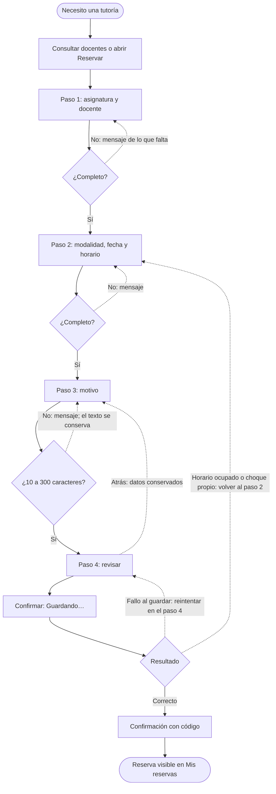
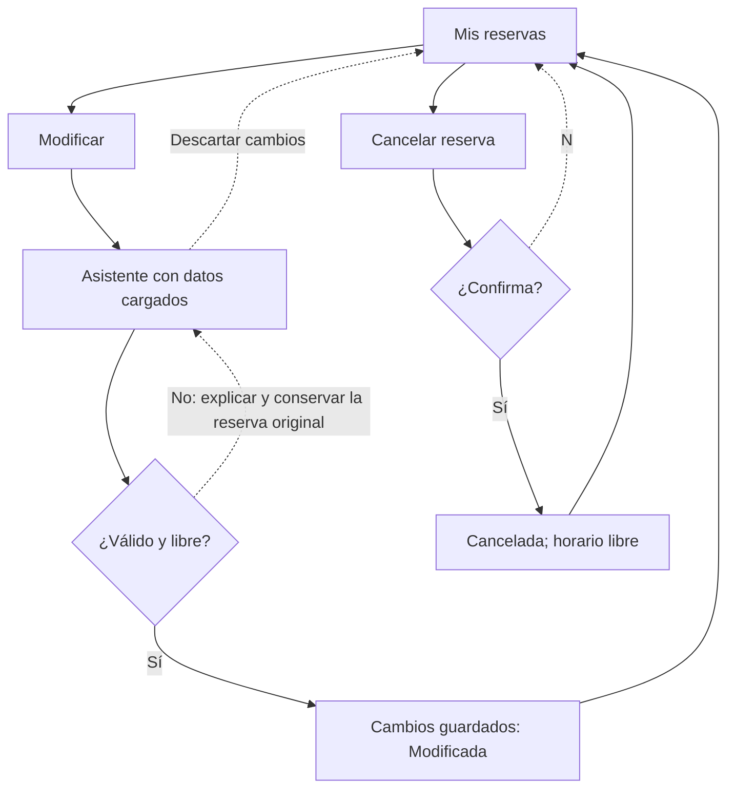

# User flow: reservar una tutoría

Camino exitoso en línea continua; recuperación de errores en línea punteada.

```mermaid
flowchart TD
  A([Necesito una tutoría]) --> B[Consultar docentes o abrir Reservar]
  B --> C[Paso 1: asignatura y docente]
  C --> V1{¿Completo?}
  V1 -.No: mensaje de lo que falta.-> C
  V1 -->|Sí| D[Paso 2: modalidad, fecha y horario]
  D --> V2{¿Completo?}
  V2 -.No: mensaje.-> D
  V2 -->|Sí| E[Paso 3: motivo]
  E --> V3{¿10 a 300 caracteres?}
  V3 -.No: mensaje; el texto se conserva.-> E
  V3 -->|Sí| F[Paso 4: revisar]
  F -.Atrás: datos conservados.-> E
  F --> G[Confirmar: Guardando…]
  G --> H{Resultado}
  H -.Horario ocupado o choque propio: volver al paso 2.-> D
  H -.Fallo al guardar: reintentar en el paso 4.-> F
  H -->|Correcto| I[Confirmación con código]
  I --> J([Reserva visible en Mis reservas])
```

## Modificar y cancelar

```mermaid
flowchart TD
  L[Mis reservas] --> M[Modificar]
  M --> N[Asistente con datos cargados]
  N -.Descartar cambios.-> L
  N --> O{¿Válido y libre?}
  O -.No: explicar y conservar la reserva original.-> N
  O -->|Sí| P[Cambios guardados: Modificada] --> L
  L --> Q[Cancelar reserva] --> R{¿Confirma?}
  R -.No.-> L
  R -->|Sí| S[Cancelada; horario libre] --> L
```
